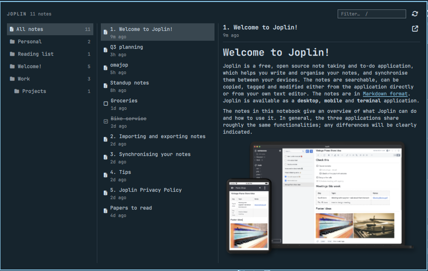

# omajop

[](https://github.com/renerocksai/omajop/actions/workflows/tests.yml)

A Joplin notes browser for the [Omarchy](https://omarchy.org/) shell bar.

A note icon sits in the bar. Click it and it expands into a Joplin-like view:
your folders and tags on the left, that source's notes in the middle, the
selected note rendered on the right.



## Install

```bash
omarchy plugin add https://github.com/renerocksai/omajop.git --enable
```

That clones into `~/.config/omarchy/plugins/org.renerocksai.omajop`, asks which bar
section to put it in (center by default), and rescans the shell itself — no
restart needed.

It also needs `sqlite3`, which is how it reads the profile:

```bash
omarchy pkg add sqlite
```

Afterwards `omarchy plugin update org.renerocksai.omajop` and
`omarchy plugin remove org.renerocksai.omajop` do what they say. To move it later:

```bash
omarchy bar move org.renerocksai.omajop --section right
```

To hack on it instead of just running it, see [Development](#development).

## Using it

| Action | |
|---|---|
| Click the bar icon | Open / close the panel |
| Middle-click the bar icon | Refresh now |
| `↑` `↓` or `j` `k` | Move within the active column |
| `←` `→` or `h` `l` | Switch between the sources column and the notes column |
| `d` `u` | Scroll the preview half a pane down / up |
| `g` `G` | Jump the preview to the top / bottom |
| `Enter` | Open the selected note in Joplin |
| `/` | Focus the search box |
| `r` | Refresh |
| `Esc` or `q` | Close |

Double-clicking a note opens it in Joplin too.

The left column lists **folders and then tags**. Selecting either scopes the
note list; `↑`/`↓` walk the whole column, stepping over the `TAGS` caption. A
note's own tags appear beside its timestamp in the preview.

Search covers **titles and note bodies** — a word that appears only inside a
note still finds it.

## Settings

**You should not need to set any of these.** With no configuration omajop reads
the standard Joplin desktop profile and keeps itself up to date; the defaults
below are what it uses when `shell.json` says nothing about it.

| Key | Default | Change it when |
|---|---|---|
| `profilePath` | `~/.config/joplin-desktop` | Your profile is elsewhere — a portable profile, or a second Joplin started with `--profile` |
| `sortBy` | `updated` | You would rather browse alphabetically: `title` |
| `refreshSeconds` | `60` | You want outside edits noticed sooner, or less polling on battery. 5–3600 |

To change one:

```bash
omarchy bar set org.renerocksai.omajop sortBy title
```

or edit the widget's entry in `~/.config/omarchy/shell.json` directly. Every
value is clamped in `Model.mjs` on the way in, because `shell.json` is
hand-editable and the manifest schema is only a hint — a test holds the
manifest's defaults and the model's clamps to each other, so they cannot
drift apart.

## IPC

```bash
omarchy-shell org.renerocksai.omajop open|close|toggle|refresh
```

## How it works

omajop reads the Joplin desktop app's SQLite profile directly, read-only, via
the `sqlite3` CLI. That is a deliberate choice over Joplin's Data API:

- **The Data API only answers while Joplin desktop is running.** A bar widget is
  up whenever your session is; the desktop app usually is not. An API-backed
  widget would be blank most of the time.
- **No service to enable, no token to manage.** The Web Clipper service stays off.
- **Quickshell has no SQLite binding**, so either route means shelling out.
  `sqlite3 -readonly -json` is less machinery than HTTP, not more.

### The one hard rule: it never writes

Joplin tracks local changes across `item_changes`, `sync_items`, and
`deleted_items`. A direct `UPDATE` to `notes` bypasses all of it, so the edit
would either never sync or be clobbered on the next pull. omajop opens the
database `-readonly` and has no code path that writes.

Editing is therefore delegated: **Open in Joplin** (`Enter`, or the button above
the preview) hands the note to the desktop app over its registered
`joplin://x-callback-url/openNote` URL scheme, starting it if it is not running.

### Images

Note bodies refer to attachments as `` in Markdown, or
`">` in an HTML note. Both are handled. The bytes are on disk at
`<profile>/resources/<id>.<extension>`.

Rewriting those to `file://` URLs and handing the Markdown to a `Text` element
does not work: **Qt's Markdown renderer reserves space for a `file://` image and
then paints nothing.** So omajop splits a body into segments — prose and images —
and renders each image with a real `Image` element. That also lets it bound an
image to the pane width without upscaling a small one, which is what
`sourceSize` would do if you used it as a cap.

Links to non-image attachments stay inline in the Markdown, rewritten to
`file://` so clicking one opens it with `xdg-open`. A reference whose resource
row has gone degrades to a label rather than leaving a raw `:/id` in the text.

### Search

The filter matches **titles instantly and bodies through Joplin's own index**.
Joplin maintains an FTS4 table, `notes_fts`, so searching bodies costs one extra
query rather than reading every note. Body matches widen the title match; they
never replace it, so the list stays responsive while the query is in flight.

FTS4 fails the *whole* query on a malformed `MATCH` expression — a bare `AND`,
an unbalanced quote, a stray `*` — so input is reduced to plain terms, each
prefix-matched so a half-typed word still finds notes. Lowercasing is what makes
that safe: FTS4 only treats `AND`/`OR`/`NOT`/`NEAR` as operators in uppercase, so
a lowercase term can never become one. A profile whose schema predates
`notes_fts` simply falls back to matching titles.

### Theme-aware text

Two things Qt's Markdown importer gets wrong inside a themed panel, both worked
around by rewriting the body as inline HTML (which, unlike a `file://` image,
*does* survive the importer):

- **Links.** It bakes a near-black blue into the character format, and
  `Text.linkColor` does not override it — ask for a red link and you still get
  blue. Links are rewritten as `<a style="color:…">` carrying the theme accent.
- **Code.** Inline spans and fenced blocks are drawn with the system fixed font
  at *its* point size rather than the item's, so they tower over the surrounding
  text. Both are rewritten with an explicit `font-size`. A fenced block becomes a
  blockquote of per-line code spans: `<pre>` would be the obvious choice, but the
  importer treats it as inline and collapses the block onto the previous
  paragraph.

An HTML note (`markup_language = 2`) is rendered as RichText, which skips the
Markdown rewriting — but Qt renders *its* anchors and code exactly as badly, so
the same treatment is applied to the HTML directly. The panel's link colour wins
over one the note carries: a clipped page's colours are chosen for a white
background and are routinely illegible on a dark one.

Only a literal colour and a literal pixel size are allowed into a style
attribute, and code content is escaped, so note text cannot inject markup.
Links inside code stay literal.

Known limitation: Markdown **table borders** still use Qt's default colour
rather than the theme's. Fixing that would mean converting tables to styled
HTML, which is a lot of parsing for a thin gain on a dark theme.

### Tags

Tags live in `tags`, joined to notes through `note_tags`. Two things make the
counts less obvious than they look:

- **Neither table has a `deleted_time` column.** A `note_tags` row outlives the
  note it points at, so counts are taken against the notes actually on screen,
  not the join table's own size. A tag whose notes are all in the trash reads 0,
  not 3.
- **A tag with no notes still has to appear**, or it looks like the list failed
  to load. One `LEFT JOIN` query yields both, including the null row for an
  empty tag, and duplicate pairings are counted once.

### Details that matter

- Notes are filtered with `deleted_time = 0 AND is_conflict = 0`. The trash and
  conflict copies live in the same table as ordinary notes.
- Joplin writes with a rollback journal, not WAL, so a reader can meet a write
  lock. Queries set `.timeout 3000` and wait rather than fail.
- Bodies are plaintext at rest — Joplin applies end-to-end encryption at sync
  time, not on disk. A note that *is* encrypted locally is labelled rather than
  shown as ciphertext.
- Preview bodies are capped at 20,000 characters in SQL, so the JSON is always a
  complete document. A truncated preview says so.
- The schema version is checked against the one this widget was written against
  (53). A mismatch shows a notice; it is not fatal, since the columns read here
  have been stable for a long time.

## Development

To work on it, clone anywhere and symlink the checkout in under the plugin id:

```bash
git clone https://github.com/renerocksai/omajop.git
ln -s "$PWD/omajop" ~/.config/omarchy/plugins/org.renerocksai.omajop
omarchy bar put org.renerocksai.omajop
omarchy restart shell
```

> Plugin code is reloaded on save, but when the plugin directory is a
> **symlink** the watcher does not see writes to the real path. Run
> `omarchy restart shell` after editing.

`omarchy plugin validate .` checks the folder against Omarchy's manifest
schema.

All SQL building, parsing, and formatting lives in `Model.mjs`, so it can be
tested without a compositor, and with no dependencies to install:

```bash
npm test
```

CI runs exactly that on Node 20, 22 and 24. Alongside the behaviour tests, it
checks `manifest.json` against the model: every declared setting must have a
default, every default must survive the model's own clamping, and the `sortBy`
options must be the ones the model accepts. `shell.json` is hand-editable and
the manifest schema is only a hint, so a default the model would rewrite is a
default that lies about what the widget does.

qmllint is not run in CI: it needs Qt 6 *and* the Omarchy shell's own
components at `/usr/share/omarchy/shell` to resolve `qs.Ui` and `qs.Commons`,
neither of which exists on a runner. Locally:

```bash
mkdir -p /tmp/qmlroot && ln -sfn /usr/share/omarchy/shell /tmp/qmlroot/qs
qmllint -I /tmp/qmlroot BarWidget.qml Panel.qml
```

Remaining `unqualified` and `missing-property` warnings come from qmllint not
resolving Quickshell's dynamic types inside delegates; the first-party plugins
produce the same categories.

## License

MIT
